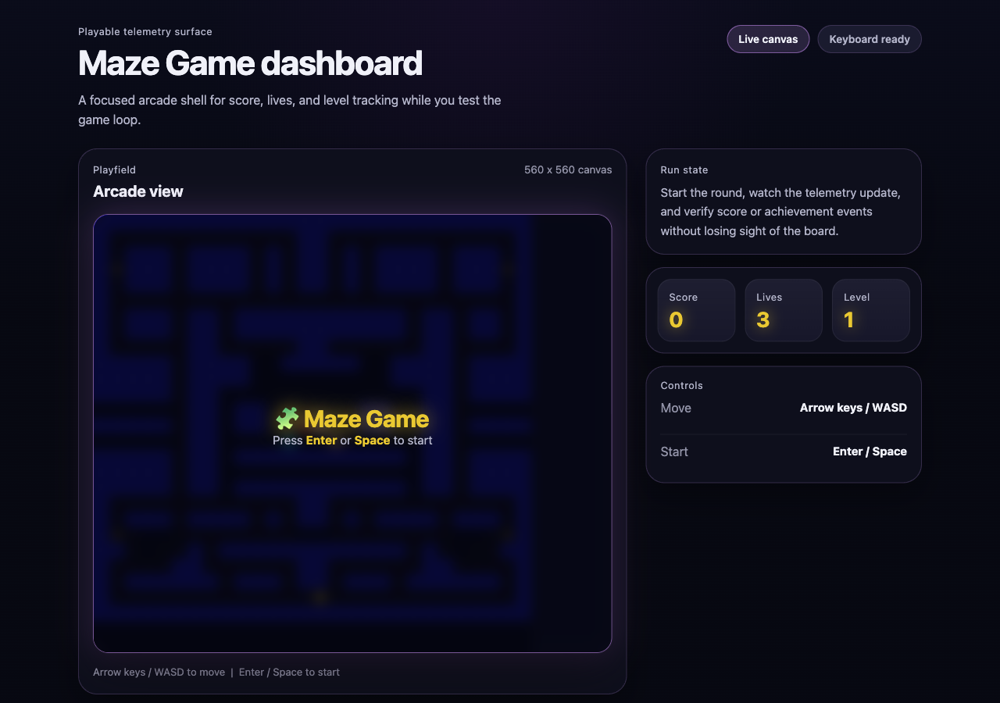

# 🧩 Maze Game

A browser-based maze game with a modern dashboard shell, built with vanilla JavaScript and [Vite](https://vite.dev/).



This repository is the **Game Agent** side of a broader **GitHub Copilot Apps** demo. It keeps Maze Game playable while acting as the event producer for the wider system.

Reference demo video:
- https://www.youtube.com/watch?v=fpP20wKaKRc&t=1s

- **In this repo** — context-aware code reasoning, safe event instrumentation, and gameplay-preserving changes
- **In the broader system** — backend services, multi-repo orchestration, full-stack generation, and end-to-end event flow with [NickAzureDevops/maze-game-services](https://github.com/NickAzureDevops/maze-game-services)

Together, this Maze Game repo and [NickAzureDevops/maze-game-services](https://github.com/NickAzureDevops/maze-game-services) demonstrate:

- **Context-aware reasoning** — Copilot understands existing code in both repos and makes targeted changes.
- **Planning and approval workflow** — Plans can be generated, reviewed, and then executed across repos.
- **Multi-repository orchestration** — Copilot coordinates changes in the producer and consumer repos together.
- **Full-stack generation** — The demo spans frontend gameplay, backend services, and dashboard behavior.
- **Event-driven architecture understanding** — Copilot models the flow from game events to service ingestion to UI updates.

## Event Contract (Producer Side)

This repo only emits fire-and-forget HTTP events to:

`http://localhost:3001/event`

Allowed event types:

- `scoreUpdated`
- `achievementCandidate`

Event envelope:

```json
{
  "type": "scoreUpdated | achievementCandidate",
  "timestamp": "ISO-8601",
  "payload": {}
}
```

Typical payloads emitted by this repo:

- `scoreUpdated`: `{ "score": 100, "delta": 10, "level": 1 }`
- `achievementCandidate`: `{ "score": 500, "achievement": "Reached 500 points!", "level": 1 }`

## Agent Skill

This repo includes a reusable prompt skill:

- `.github/prompts/event-schema-validation.prompt.md`

Use it to validate producer-side contract compliance before demos or merges.

## Controls

| Key | Action |
|-----|--------|
| `Arrow Keys` / `WASD` | Move player |
| `Enter` / `Space` | Start / resume game |

## Getting Started

- [Node.js](https://nodejs.org/) (v18 or later recommended)

```bash
npm ci
npm run dev
```

Open [http://localhost:5173](http://localhost:5173) in your browser.

```bash
npm run build
npm run preview
```
